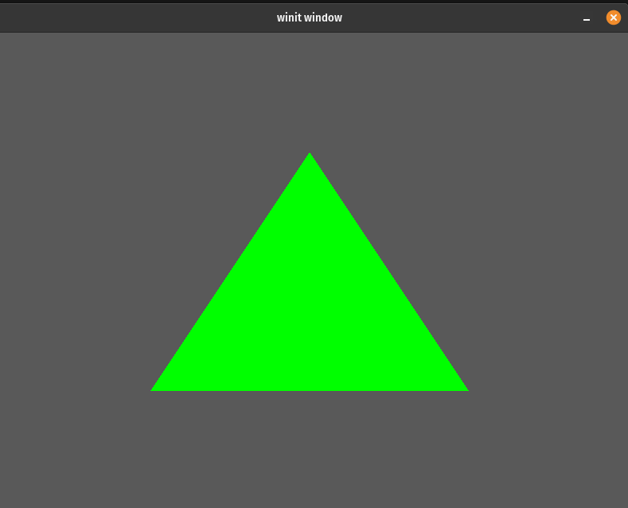

# Ellipsoid

Ellipsoid is a Rust graphics library designed to create 2D games in a simple and efficient manner. It provides a wide range of functionality, including window management, rendering, input handling, shape manipulation, and transformations.

Compared to other Rust frameworks like `ggez` or `macroquad`, `ellipsoid` shines in shape creation and manipulation. Additionally texture support is built in through `enums`, which ensures much safer access than for instance using `HashMap`.

If you plan to build games in this framework you should expect, that you will hit a wall and at some point have to either make a fork or contribute to the project, since a some relevant features are still missing.

## Getting Started

To start using the Ellipsoid library, add it as a dependency in your `Cargo.toml`, together with your favorite async runtime and strum. 

Then just import all the important stuff from the `ellipsoid::prelude` module.

```toml
[dependencies]
ellipsoid = "0.3"

async-std = "1.12.0"
strum = { version = "0.24.1", features = ["derive"] }
```

```rust
use ellipsoid::prelude::*;
```

## Key Components

### App trait

The `App` trait is implemented by the main application struct. This trait provides methods for creating a new instance of the application, handling input events, updating the application state, and drawing geometry.

### Graphics

The `Graphics` struct is responsible for handling rendering and window. It allows users to add custom geometry and draw it to the screen.

### Shape

`Shape` is a struct that represents various geometrical shapes. Methods for creating circles, squares, triangles, lines, and polygons are provided, as well as functionality for applying transformations and setting properties like texture, color, and z-index.

### GTransform

`GTransform` is a struct for applying transformations to shapes. It supports translation, rotation, and scaling operations, and can be chained to apply multiple transformations.

### Color

The `Color` struct represents colors, which can be applied to various shapes.

## Example: Creating a simple application

Here's a minimal example for creating a simple window with a custom shape:

1. `lib.rs`
    ```rust
    #![feature(async_fn_in_trait)]

    use ellipsoid::prelude::*;
    use strum::{EnumIter, Display};

    struct MyApp {
        graphics: Graphics<MyTextures>,
    }

    #[derive(Debug, Clone, Copy, EnumIter, Display, Default)]
    #[strum(serialize_all = "snake_case")]
    enum MyTextures {
        #[default]
        White,
    }

    impl Into<u32> for MyTextures {
        fn into(self) -> u32 {
            self as u32
        }
    }

    impl Textures for MyTextures {}

    impl App<MyTextures> for MyApp {
        async fn new(window: winit::window::Window) -> Self {
            let graphics = Graphics::<MyTextures>::new(window).await;
            MyApp { graphics }
        }

        fn update(&mut self, _dt: f32) {}

        fn draw(&mut self) {
            let triangle = Shape::from_triangle().set_color(Color::GREEN);
            self.graphics.add_geometry(triangle.into());
        }

        fn input(&mut self, _event: &WindowEvent) -> bool {
            false
        }

        fn graphics_mut(&mut self) -> &mut Graphics<MyTextures> {
            &mut self.graphics
        }

        fn graphics(&self) -> &Graphics<MyTextures> {
            &self.graphics
        }
    }

    #[cfg_attr(target_arch = "wasm32", wasm_bindgen(start))]
    pub async fn start() {
        ellipsoid::run::<MyTextures, MyApp>().await;
    }
    ```

2. `main.rs`
    ```rust
    use simple_app_readme::start;

    fn main() {
        async_std::task::block_on(start());
    }
    ```
3. Add default texture of choice to `assets/textures` (create directory in project root), for me white pixel usually does the trick
4. Enjoy the nice green triangle: 


Please refer to the provided Pong game example for a more comprehensive demonstration of Ellipsoid's features and capabilities.

## License
This project is licensed under the MIT License.